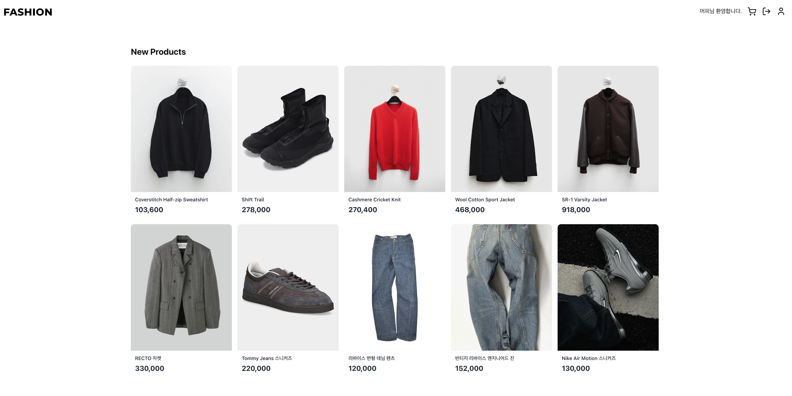
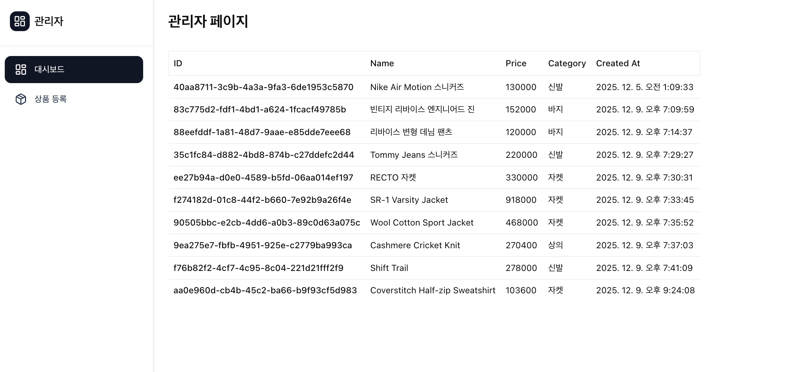
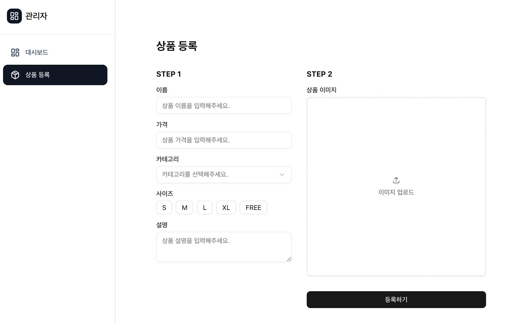
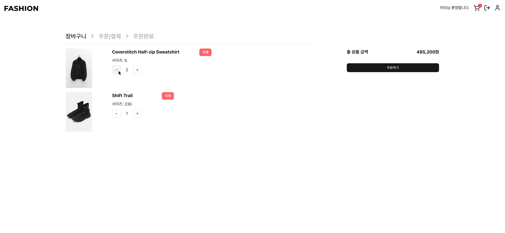
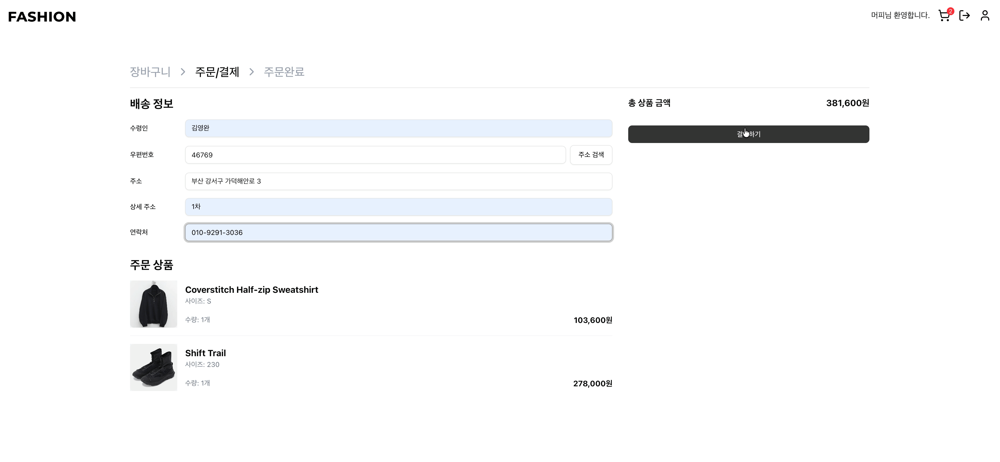
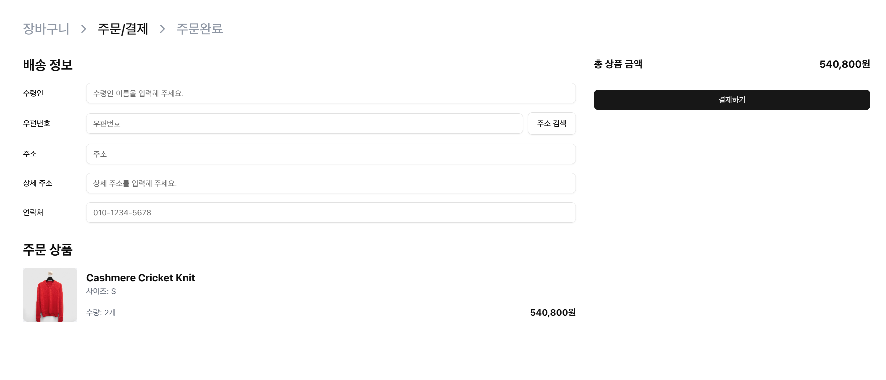

# Fashion

“패션 커머스 웹 서비스 MVP”



## 1. **프로젝트 소개**

사용자가 상품을 탐색하고, 장바구니/주문/결제까지 이어지는 커머스 핵심 플로우를 구현한 패션 커머스 MVP입니다.

## 2. 주요 기능

### 상품

- 홈에서 최신 상품을 카드 형태로 확인하고 반응형 레이아웃으로 기기 너비에 맞춰 노출
- 상품 상세 페이지에서 사이즈 옵션 선택 및 장바구니 추가

### 장바구니 & 결제

- 로그인 여부에 따라 로컬(Redux)·서버(Supabase) 장바구니를 스위칭
- 주문/결제 단계에서 배송지 정보 입력 + 다음 우편번호 서비스 연동, 주문 완료 시 Supabase orders 테이블에 저장 후 장바구니 비우기

### 마이페이지

- 마이페이지에서 주문 내역/주문별 항목을 조회

### 관리자 페이지

- 관리자 페이지에서 상품 목록 조회.
- 상품 등록 폼에서 React Hook Form + Zod로 유효성 검사를 수행하고, Supabase Storage에 이미지 업로드 · Public URL 발급.

## 3. 기능 시연

### 관리자


### 관리자 대시보드 및 상품 등록




### 로컬·서버 장바구니 통합


### 상품 주문 플로우




### 배송지 입력 및 주문 내역




## 4. 프로젝트 구조

```
src/
├── app/ # Next.js App Router 엔트리
│ ├── (user)/ # 사용자 전용 라우트 (홈, 상품, 장바구니, 결제, 인증, 프로필)
│ └── (admin)/ # 관리자 전용 레이아웃 및 페이지
├── components/
│ ├── layout/ # Header/Footer 등 공용 레이아웃
│ ├── product/ # 상품 카드 등 쇼핑 UI
│ ├── checkout/ # 장바구니/결제 전용 컴포넌트
│ ├── profile/ # 주문 내역 UI
│ ├── admin/ # 관리자 사이드바, 이미지 업로드 컴포넌트
│ └── ui/ # shadcn/ui 래핑 컴포넌트
├── hooks/ # TanStack Query 및 상태 동기화 커스텀 훅
├── lib/ # Supabase 클라이언트, Redux/Query Provider
├── store/ # Redux Toolkit + Persist 설정 및 슬라이스
├── types/ # Product/Cart/Order 타입 정의
└── utils/ # 장바구니 합계, 서버 동기화 등 공용 유틸
```
